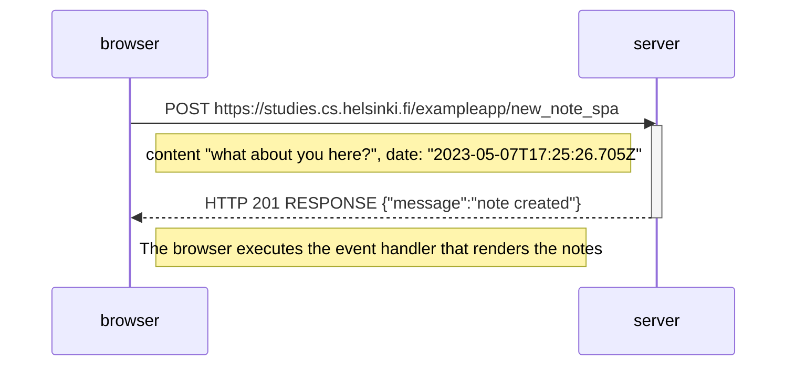

```mermaid
sequenceDiagram
    participant browser
    participant server

    browser->>server: POST https://studies.cs.helsinki.fi/exampleapp/new_note_spa
    activate server
    Note right of browser: content "what about you here?", date: "2023-05-07T17:25:26.705Z"
    server-->>browser: HTTP 201 RESPONSE {"message":"note created"}
    deactivate server

 Note right of browser: The browser executes the event handler that renders the notes
```
